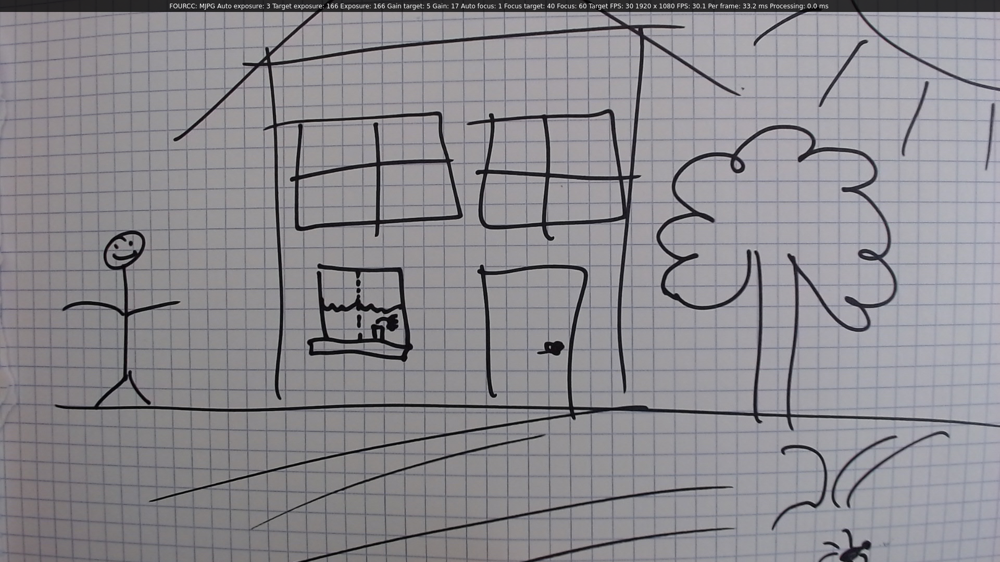
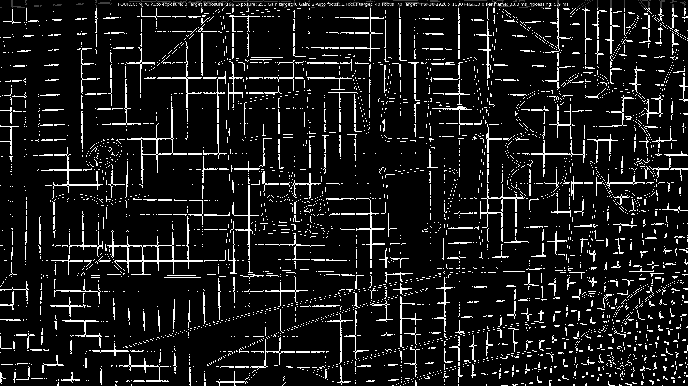

# OpenCV Webcam Manipulation
We use OpenCV in C++ to manipulate the webcam feed and write it to a virtual
video device. We have a debug window to control some webcam settings and
display information. This could be useful as a starting point for webcam
stream processing.

This is developed in Void Linux using a Logitech C920 HD Pro webcam.

## Building
(Works for my development environment, but it is setup weirdly)
No makefile, sorry.

```shell
/usr/bin/g++ src/videocapture_camera.cpp -o build/videocapture_camera `pkg-config --cflags --libs opencv4 cblas`
```

## Usage
The program spawns a GUI window with the video feed from the webcam and a
bar with some information on webcam settings. Some settings can be changed
using the keybindings below.





The included shellscript creates a virtual video stream using `video4linux`
at `/dev/video20`. The opencv program will output the transformed video stream
to this device by default. This is the device you'll use for your video
conferencing software for example.

The frame processing is the Canny edge detector included in `opencv`.

### Key bindings
| Key        | Function |
|:-------------:|:-------------:|
| `Esc`      |  Quit |
| `Space`    |  Toggle frame processing |
| `r` | Cycle between capture resolutions |
| `c` | Cycle between capture codecs |
| `e` | Toggle auto-exposure |
| `q` | Decrease exposure |
| `w` | Increase exposure |
| `a` | Decrease gain |
| `s` | Increase gain |
| `u` | Toggle auto-focus |
| `t` | Decrease focus value (focus farther objects) |
| `y` | Increase focus value (focus nearer objects) |

### Notes
* Auto-exposure actually sets both the GAIN and the EXPOSURE automatically on
  my setup.
* On my setup, ISO\_SPEED does not correspond to anything.
* There can be a mismatch between a command value and actual value (eg. for
  resolution or exposure) but the webcam will just adjust to the closest
  matching value it supports.
* Funnily enough, the sensor on the webcam is actually bigger than the
  advertised 1080p and images/videos can be taken at this higher size.

## Caveats
* There are colorimetric flags for cameras in OpenCV. But this is a can of
  worms I do not want to get into.
* This project is written very much like a script. It is meant to be used
  as a starting point for projects that use webcam streams.

## References
* [OpenCV VideoIO flags] (https://docs.opencv.org/4.3.0/d4/d15/group__videoio__flags__base.html)
* [videocapture_camera.cpp] (https://github.com/opencv/opencv/blob/master/samples/cpp/videocapture_camera.cpp) I started from this opencv sample file.
